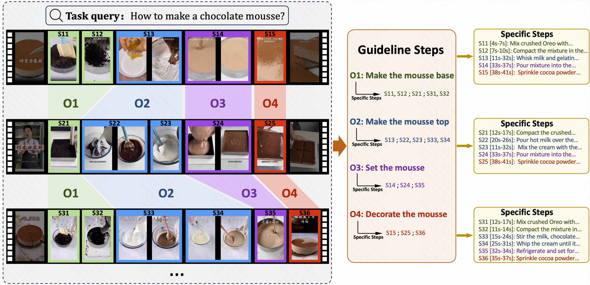

# GUIDE
we present the GUIDE (Guideline-Guided) dataset, which contains 3.5K videos of 560 instructional tasks in 8 domains related to our daily life. Specifically, we annotate each instructional task with a guideline, representing a common pattern shared by all task-related videos. On this basis, we annotate systematic specific steps, including their associated guideline steps, specific step descriptions and timestamps.


## Evaluation
You can use our dataset to evaluate the model's **single-video** and **multi-video** comprehension simultaneously!
### Task 1: Step Captioning
This task evaluates the models’ capabilities to understand the procedural temporal knowledge of the instructional video. In this task, models have to generate a set of instructional step captions.
```
INPUT: <vid><Video></vid>
OUTPUT: {Specific Step 1: ... , Specific Step 2: ... , Specific Step 3: ... , ...}
```
### Task 2: Guideline Summarization
This task evaluates the models’ capabilities to analyze correlations across videos. In this task, models have to mine the common pattern in task-related videos and summarize a guideline from them.
```
INPUT: <vid><Task-related Video 1></vid> , <vid><Task-related Video 2></vid>, ...
OUTPUT: {Guideline Step 1: ... , Guideline Step 2: ... , Guideline Step 3: ... , ...}
```
### Task 3: Guideline-Guided Captioning
To explore the impact of guidelines on step captioning, we propose the guideline-guided captioning task. In this task, models have to generate specific step captions under the guide of guideline.
```
INPUT: {Guideline Step 1: ... , Guideline Step 2: ... , Guideline Step 3: ... , ...} + <vid><Video></vid>
OUTPUT: {Specific Step 1: ... , Specific Step 2: ... , Specific Step 3: ... , ...}
```
## Annotations

## Dataset Construction Pipeline 

## Acknowledgements

## Citation


