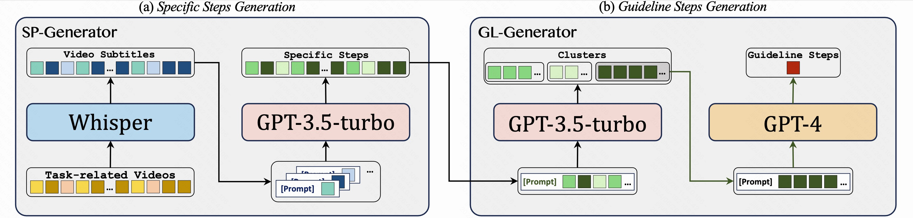

# GUIDE(IJCAI 2024)

[GUIDE Homepage](https://guide-ijcai2024.github.io/)

If you want to get the dataset annotation, please fill out the [form](https://docs.google.com/forms/d/e/1FAIpQLScYb2Y54LegHrOdLsz3fAknvU1-u8qCKrnSmVovNXD93VMNFQ/viewform).

we present the GUIDE (Guideline-Guided) dataset, which contains 3.5K videos of 560 instructional tasks in 8 domains related to our daily life. Specifically, we annotate each instructional task with a guideline, representing a common pattern shared by all task-related videos. On this basis, we annotate systematic specific steps, including their associated guideline steps, specific step descriptions and timestamps.


## Evaluation
You can use our dataset to evaluate the model's **single-video** and **multi-video** comprehension simultaneously!

### Task 1: Step Captioning
This task evaluates the models’ capabilities to understand the procedural temporal knowledge of the instructional video. In this task, models have to generate a set of instructional step captions.
```
INPUT: <vid><Video></vid>
OUTPUT: {Specific Step 1: ... , Specific Step 2: ... , Specific Step 3: ... , ...}
```
### Task 2: Guideline Summarization
This task evaluates the models’ capabilities to analyze correlations across videos. In this task, models have to mine the common pattern in task-related videos and summarize a guideline from them.
```
INPUT: <vid><Task-related Video 1></vid> , <vid><Task-related Video 2></vid>, ...
OUTPUT: {Guideline Step 1: ... , Guideline Step 2: ... , Guideline Step 3: ... , ...}
```
### Task 3: Guideline-Guided Captioning
To explore the impact of guidelines on step captioning, we propose the guideline-guided captioning task. In this task, models have to generate specific step captions under the guide of guideline.
```
INPUT: {Guideline Step 1: ... , Guideline Step 2: ... , Guideline Step 3: ... , ...} + <vid><Video></vid>
OUTPUT: {Specific Step 1: ... , Specific Step 2: ... , Specific Step 3: ... , ...}
```
## Annotations

```
{
"query": "How to Fry mud snail",
"category": "Food",
"guideline_steps_num": 2,
"guideline_steps": {
	"1": "Processing Mud Snails.",
	"2": "Cooking with Ingredients."},
"videos": {
	"3xumfqxgm76yq6q": {
		"specific_step": {
			"0": {
				"title": " Clean the Mud Snail ",
				"guideline_step": "Processing Mud Snails.",
				"bounds": [5.0, 34.0]},
			"1": {
				"title": " Making Sauce ",
				"guideline_step": "Cooking with Ingredients.",
				"bounds": [35.0, 51.0]},
			...... ,},
	"3xkfuf9htyq7mbc": {
		"specific_step": {
			"0": {
				"title": " Water boiling and mud snail scalding ",
				"guideline_step": "Processing Mud Snails.",
				"bounds": [5.0, 8.0]},
			"1": {
				"title": " Making Sauce ",
				"guideline_step": "Cooking with Ingredients.",
				"bounds": [9.0,15.0]},
			...... ,},
	...... ,}
},
......
```

## Dataset Construction Pipeline 

1. **Video Collection**(Manually): Collect high-quality instructional videos.
2. **Automatic Annotation**

3. **Manual Annotation**(Manually): Manually optimized annotations.

## Citation
```
@inproceedings{GUIDE,
  author    = {Jiafeng Liang, Shixin Jiang, Zekun Wang, Haojie Pan, Zerui Chen, Zheng Chu, Ming Liu, Ruiji Fu, Zhongyuan Wang and Bing Qin},
  title     = {GUIDE: A Guideline-Guided Dataset for Instructional Video Comprehension},
  booktitle = {IJCAI},
  year      = {2024},
}
```
